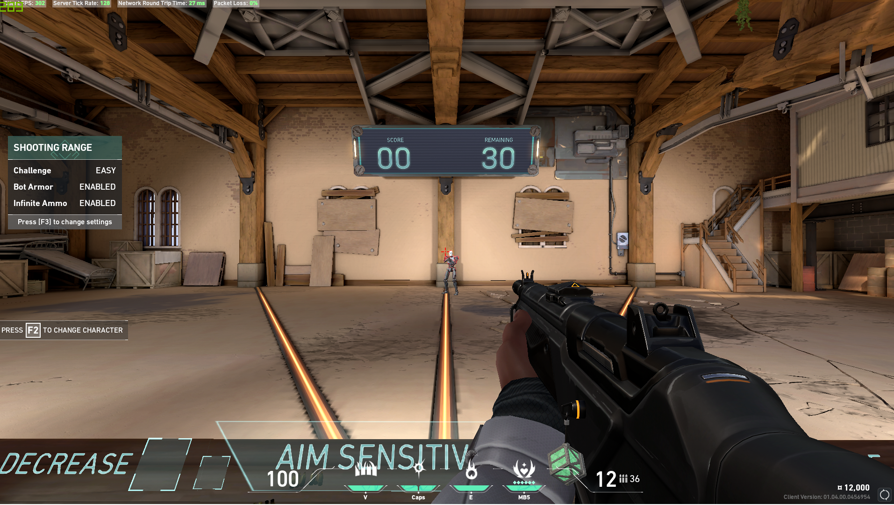

```{r setup, include=FALSE}
knitr::opts_chunk$set(echo = TRUE)
```

# Introduction

On this past 2nd of June, Riot Games, Inc. released the highly-anticipated, first-person shooter video game _Valorant_. General gameplay features five-player teams competing against one another to complete various objectives, armed with conventional video game weapons and other special abilities. Billed as an "Esports ready" game, the mechanics of the game are non-randomised, allowing players to build and test their skills in an unchanging environment. Accordingly, the only uncontrolled covariate in-game is the players themselves.

# Objectives

I am acquainted with a _Valorant_ team undergoing an internal dispute. In question are two factors: 1.) the superiority of Player A over Player B with regard to general reflexes and game skill; and 2.) the superiority of Rifle A over Rifle B with regard to usefulness in general gameplay. 'Usefulness' in this instance is understood to mean the factor by which the rifle simplifies the 'killing' of enemies; a core gameplay objective. Accordingly, I propose to run a $2^{2}$ design experiment, with the two different players and rifles as factors. Factorial design is particularly appropriate in this scenario, as there is the possibility that one player is superior to the other with the use of one weapon but not the other. Given that regular gameplay is time-limited, players have a general interest to complete objectives as quickly as possible. As such, the measured experimental outcome will be the time taken to complete a stated objective in-game.

# Methods

## General Experimental Design

The player under observation will use _Valorant_'s "shooting range" mode, which features standardised, computer-controlled "bots" to practice against in lieu of human opponents. In the set-up options, shooting range gameplay will have "Bot Armor", "Infinite Ammo", and "Bots Strafe" turned on. Functionally, these options allow the closest approximation in a controlled environment one can have of normal gameplay against human opponents. The player will then select one of the two rifles under consideration. This can be considered the preparation for the experiment.

The experimental procedure itself is having the player play through the shooting range's "Eliminate 100 Streak" mode: this involves the player 'killing' 100 bots in as short a time as possible. Due to the selected options, the bots move semi-randomly while requiring more shots to 'kill'; the player is also not required to reload their weapon. This means that any outcome is totally dependent solely on the player's reflexes and control of the weapon. As aforementioned, the resultant time taken is the experimental outcome to be recorded.

This process will be observed for both players, using both rifles, yielding four experimental outcomes. Following standard experimental procedure, experiments will be replicated multiple times with a random ordering of trials.

```{r figure, echo=FALSE, fig.align='center', fig.cap="The shooting range", out.width = '100%'}

```

## Controlling Confounding & Interacting Variables

The players in question have comparable computer systems and accessories, with any differences in hardware being negligible. Due to the pre-programmed nature of the shooting range, there should be no difference in set-up for the experiment. Although the bots move semi-randomly during gameplay, their slow speed assures that any effect on outcome can be rendered negligible with replication. Both players will experiment simultaneously, running two simultaneous trials at a time. However, trials will be scheduled so that the time elapsed since both have played a regular game of _Valorant_ remains constant. Finally, given the very recent release of _Valorant_, both players have roughly equal experience with the game.

# Statistical Analysis

To assure that experimental conditions remain consistent, sufficient replication will be performed such that each experimental outcome can have its trials graphed on a Q-Q plot. Each trial will be randomly assigned to consecutive integers, and the theoretical model against which it will be compared will be a constant 'linear model' at the average experimental outcome. These plots will assure that residual deviation from Gaussian behaviour is detected. The estimate of the error variance and standard error of factorial effect for duplicated runs will also be checked for acceptability.

Calculated interaction effects may then be divided by the standard error and compared to a t-distribution with four degrees of freedom. 95% should be an acceptable confidence level for this experiment. Accordingly, values outside the 95% confidence interval calculated in R will be judged to be significant. The relationships will be accompanied in the report with interaction plots.