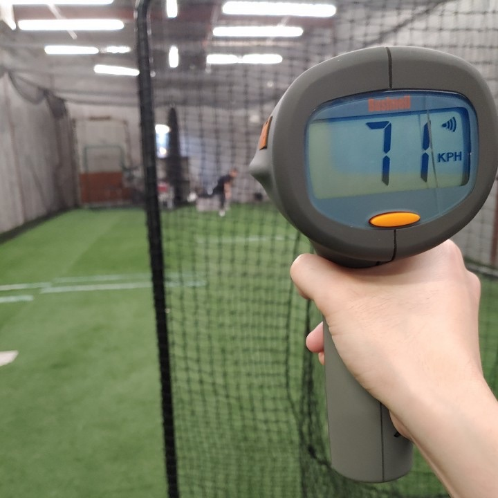

```{r setup, include=FALSE}
knitr::opts_chunk$set(echo = FALSE, warning = FALSE, message = FALSE)
library(knitr)
# kableExtra is a useful library 
# if you wish to customize how your tables
# render in the documents.
# see: https://haozhu233.github.io/kableExtra/awesome_table_in_pdf.pdf 
# library(kableExtra) 
```

Note you will need `bookdown` package installed to render this template. It allows easy cross-referencing figures and tables. See [here](https://bookdown.org/yihui/rmarkdown-cookbook/cross-ref.html).

# Description

Add your project description here.

You may choose to include an image from your experiment to describe your experiment. Please keep your image file in the same directory as your Rmd file so that you don't need to list the full path to your file. This helps the grading TA to run your Rmd file without worrying about incorrect file paths. Your can refer to Figure \@ref(fig:speedgun)  with `Figure \@ref(fig:speedgun)`.


```{r speedgun, out.width=".3\\linewidth", fig.align="center", fig.cap="Remeber to include an appropriate caption for your figures."}
# out.width=".3\\linewidth" sets the output
# width to 30% of the paragraph width.

```

# Analysis

Add your analysis method and results here.

Below is a sample code for reading a data file for your project. Alternatively, you may choose to input your outcomes directly in R, but this is not recommended as it is more difficult to catch typos.

```{r echo=TRUE}
# If you plan to use a separate data file,
# I recommend using a csv format. A spreadsheet
# software (e.g., MS Excel, Apple Numbers) provide
# options to export your tables in the csv format.
# Keep your csv file in the same directory as your
# Rmd file so that you don't need to list the full
# path to your file. This helps the grading TA
# to run your Rmd file without worrying about
# incorrect file paths.
results <- read.csv('data.csv')
```

Table \@ref(tab:tab1) is a sample table. It is not recommended that you include of a table to show the whole data but you may want to include tables for summary statistics and other analysis results. You can refer to the table using `Table \@ref(tab:tab1)`.

```{r tab1}
kable(results, booktabs = TRUE,
      caption = "Your caption for tables go here.")
```

Figure \@ref(fig:fig2) is a sample for placing subfigures in your report. Feel free to reuse the code to place your own plots. You will need to generate the appropriate plots that fit your own experiment. 

```{r fig2, echo=FALSE, fig.width=5, fig.asp=1, fig.cap="This is figure caption for all subfigures.", fig.subcap=c("This is caption for the first subfigure.", "This is caption for the second figure"), fig.ncol=2, out.width=".4\\linewidth", fig.align="center"}
plot(results$observed.speed, frame.plot = FALSE,
     pch = ifelse(results$finger.split == "Y",
                  20, 4),
     col = ifelse(results$leg.kick == "Y",
                  3, 2))
boxplot(observed.speed ~ leg.kick + finger.split,
        data = results, at = c(1:2, 4:5),
        col = rep(2:3, 2),
        frame.plot = FALSE)
```


# Conclusions and Discussions

Add your conclusions and any additional discussions here.